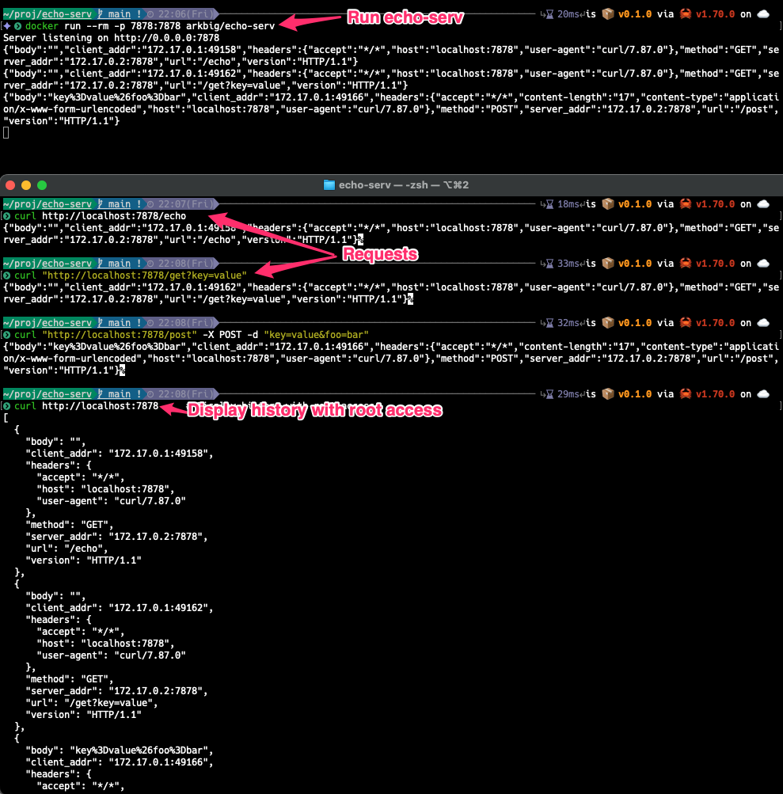

# Echo Serv

This `echo-serv` command accepts HTTP requests and returns the request information.

## TODO

**This is still the first version.**

## Usage from Docker Hub

1. `docker run --rm -p 7878:7878 arkbig/echo-serv`
2. `curl http://localhost:7878/echo`
   - The response is a json of request information.
3. Access <http://localhost:7878> using browser to display the request history.

## Usage from GitHub

1. Build and up container

    ```sh
    git clone https://github.com/arkbig/echo-serv.git
    cd echo-serv
    deploy/docker/replace-env.sh
    docker compose -f deploy/docker/compose.yaml up -d
    ```

2. `curl http://localhost:7878/echo`
   - The response is a json of request information.
3. Access <http://localhost:7878> using browser to display the request history.

## Demo



<details>
<summary>CLI example</summary>

```sh
$ curl http://localhost:7878/echo
{"body":"","client_addr":"172.17.0.1:36632","headers":{"accept":"*/*","host":"localhost:7878","user-agent":"curl/7.87.0"},"method":"GET","server_addr":"172.17.0.2:7878","url":"/echo","version":"HTTP/1.1"}

$ curl "http://localhost:7878/get?key=value"
{"body":"","client_addr":"172.17.0.1:36636","headers":{"accept":"*/*","host":"localhost:7878","user-agent":"curl/7.87.0"},"method":"GET","server_addr":"172.17.0.2:7878","url":"/get?key=value","version":"HTTP/1.1"}   

$ curl "http://localhost:7878/post" -X POST -d "key=value&foo=bar"
{"body":"key%3Dvalue%26foo%3Dbar","client_addr":"172.17.0.1:36640","headers":{"accept":"*/*","content-length":"17","content-type":"application/x-www-form-urlencoded","host":"localhost:7878","user-agent":"curl/7.87.0"},"method":"POST","server_addr":"172.17.0.2:7878","url":"/post","version":"HTTP/1.1"}

$ curl http://localhost:7878     # Display history with root access.
[
  {
    "body": "",
    "client_addr": "172.17.0.1:36632",
    "headers": {
      "accept": "*/*",
      "host": "localhost:7878",
      "user-agent": "curl/7.87.0"
    },
    "method": "GET",
    "server_addr": "172.17.0.2:7878",
    "url": "/echo",
    "version": "HTTP/1.1"
  },
  {
    "body": "",
    "client_addr": "172.17.0.1:36636",
    "headers": {
      "accept": "*/*",
      "host": "localhost:7878",
      "user-agent": "curl/7.87.0"
    },
    "method": "GET",
    "server_addr": "172.17.0.2:7878",
    "url": "/get?key=value",
    "version": "HTTP/1.1"
  },
  {
    "body": "key%3Dvalue%26foo%3Dbar",
    "client_addr": "172.17.0.1:36640",
    "headers": {
      "accept": "*/*",
      "content-length": "17",
      "content-type": "application/x-www-form-urlencoded",
      "host": "localhost:7878",
      "user-agent": "curl/7.87.0"
    },
    "method": "POST",
    "server_addr": "172.17.0.2:7878",
    "url": "/post",
    "version": "HTTP/1.1"
  }
]
```

</details>
